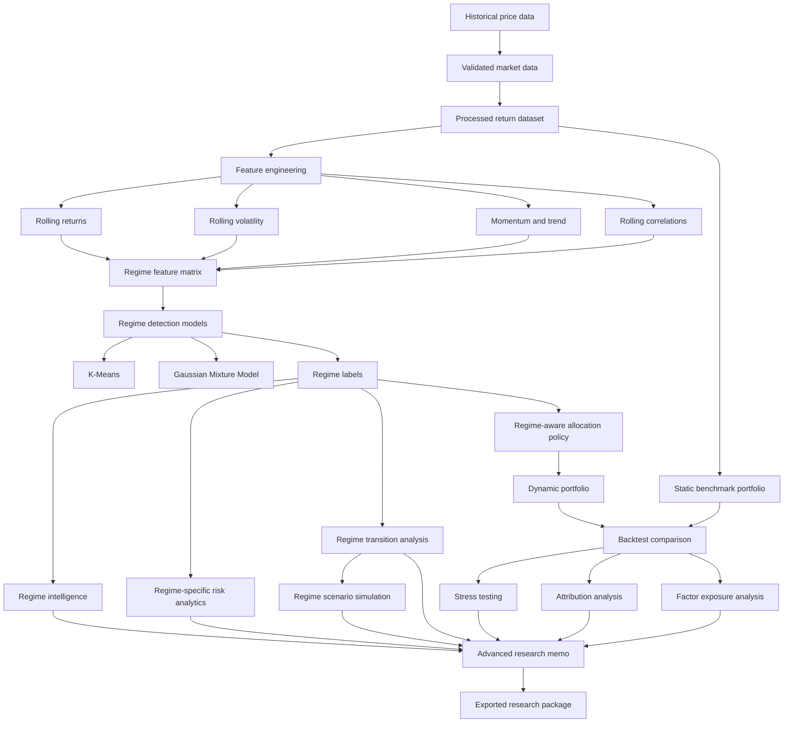

# Regime-Aware Portfolio Risk Engine

](https://github.com/jimech/regime-aware-portfolio-risk-engine/actions/workflows/ci.yml)


A production-style quantitative research engine for detecting market regimes, measuring regime-specific portfolio risk, building dynamic allocation policies, and generating investment research reports.

The project answers a practical portfolio-management question:

> Can changing market regimes be detected from financial time-series data, and can portfolio risk exposure be adjusted dynamically in response?

This repository combines financial engineering, machine learning, risk analytics, backtesting, model validation, and automated reporting into one tested Python package.

---

## Executive Summary

Traditional portfolio risk systems often evaluate a portfolio as if market conditions are stable. In reality, risk changes across environments: correlations rise during crises, diversification can break down, volatility clusters, and assets that hedge one regime may fail in another.

This project builds a full research workflow around that idea.

It detects market regimes using rolling financial features, evaluates risk within each regime, compares static and regime-aware allocation strategies, validates model behavior, and exports investment committee style research memos.

The final CLI demo can run the full advanced workflow with one command:

```bash
python -m regime_risk_engine run-advanced-demo \
  --output-dir outputs/advanced_demo \
  --analyst "Jimena Chinchilla"
```

That command creates demo inputs, runs the advanced research workflow, and exports a complete research package containing a Markdown memo and supporting CSV tables.

---

## Core Research Thesis

The project is built around the thesis that portfolio risk is regime-dependent.

A static allocation can look diversified in normal markets but become concentrated during stress if correlations rise or drawdowns occur across multiple assets. A regime-aware process attempts to identify changing environments and adjust exposure accordingly.

The research workflow tests whether a dynamic strategy can improve risk-adjusted performance relative to a static benchmark by:

* Detecting regimes from rolling return, volatility, momentum, trend, and correlation features.
* Measuring risk separately across detected regimes.
* Applying regime-aware allocation policies.
* Accounting for turnover and transaction costs.
* Comparing dynamic and static portfolios through backtesting.
* Stress testing the strategy during difficult market environments.
* Explaining performance through attribution and factor exposure analysis.
* Simulating forward regime scenarios using transition probabilities.

---

## System Architecture



---

## End-to-End Workflow

```text
Raw market data
→ Data validation
→ Return calculation
→ Feature engineering
→ Regime detection
→ Regime labeling and interpretation
→ Regime-specific risk analytics
→ Static vs dynamic allocation
→ Backtesting
→ Walk-forward validation
→ Stress testing
→ Attribution analysis
→ Factor exposure analysis
→ Regime scenario simulation
→ Advanced investment memo
→ Exported research package
```

---

## Key Features

### Market Data and Return Processing

* Multi-asset portfolio universe support.
* Historical price downloader.
* Price data validation.
* Processed return dataset generation.
* Clean separation between raw market data and research-ready returns.

### Feature Engineering

* Rolling return features.
* Rolling volatility features.
* Momentum and trend features.
* Rolling pairwise correlation features.
* Regime feature matrix construction.

### Regime Detection

* K-Means regime model.
* Gaussian Mixture Model regime model.
* Regime labeling and interpretation layer.
* Regime visualization utilities.
* Regime stability diagnostics.
* Walk-forward regime validation.
* Model selection summaries.

### Risk Analytics

* Annualized return.
* Annualized volatility.
* Sharpe ratio.
* Sortino ratio.
* Max drawdown.
* Value at Risk.
* Conditional Value at Risk.
* Regime-specific risk summaries.
* Regime correlation and covariance analytics.
* Portfolio risk contribution analytics.

### Allocation and Backtesting

* Static benchmark allocation.
* Regime-aware dynamic allocation policy.
* Allocation constraints.
* Turnover and transaction cost model.
* Portfolio backtest engine.
* Static vs dynamic strategy comparison.
* Regime-conditioned backtest evaluation.
* Backtest diagnostics.

### Advanced Research Layer

* Investment research summary generation.
* Real market research workflow.
* Market research memo builder.
* Regime intelligence and market-state labeling.
* Regime-aware portfolio optimizer.
* Optimized market research workflow.
* Walk-forward regime optimization.
* Stress-period strategy analysis.
* Strategy attribution analysis.
* Factor exposure analysis.
* Regime transition analysis.
* Forward regime scenario simulation.
* Advanced research memo builder.
* Advanced research export package.

### CLI and Reporting

* CLI healthcheck.
* Configuration inspection.
* Report export.
* Demo report workflow.
* Advanced research export workflow.
* Advanced demo input generation.
* One-command advanced demo workflow.

---

## Quickstart

### 1. Clone the repository

```bash
git clone https://github.com/jimemettr/regime-aware-portfolio-risk-engine.git
cd regime-aware-portfolio-risk-engine
```

### 2. Create a virtual environment

```bash
python -m venv .venv
source .venv/bin/activate
```

### 3. Install the package

```bash
pip install -e ".[dev]"
```

### 4. Run quality checks

```bash
ruff check .
ruff format --check .
mypy src
pytest --cov=regime_risk_engine --cov-report=term-missing
```

### 5. Run the one-command advanced demo

```bash
python -m regime_risk_engine run-advanced-demo \
  --output-dir outputs/advanced_demo \
  --analyst "Jimena Chinchilla"
```

### 6. View the exported research package

```bash
ls outputs/advanced_demo/package
cat outputs/advanced_demo/package/advanced_research_memo.md
```

The output package includes:

```text
advanced_research_memo.md
regime_intelligence_profile.csv
regime_transition_counts.csv
regime_transition_probabilities.csv
regime_persistence.csv
regime_durations.csv
most_likely_next_regime.csv
stress_test_summary.csv
asset_attribution.csv
factor_exposure.csv
dominant_factor_by_strategy.csv
scenario_terminal_summary.csv
scenario_regime_usage.csv
scenario_simulated_paths.csv
scenario_transition_probabilities.csv
```

---

## CLI Usage

### Check package health

```bash
python -m regime_risk_engine healthcheck
```

### Inspect a configuration file

```bash
python -m regime_risk_engine inspect-config \
  --config configs/base.yaml
```

### Create advanced demo inputs

```bash
python -m regime_risk_engine create-advanced-demo-inputs \
  --output-dir outputs/demo_inputs
```

### Export advanced research from CSV inputs

```bash
python -m regime_risk_engine export-advanced-research \
  --price-data outputs/demo_inputs/prices.csv \
  --static-weights outputs/demo_inputs/static_weights.csv \
  --regime-policy outputs/demo_inputs/regime_policy.csv \
  --stress-periods outputs/demo_inputs/stress_periods.csv \
  --factor-returns outputs/demo_inputs/factor_returns.csv \
  --output-dir outputs/advanced_research \
  --n-regimes 3 \
  --feature-window 10 \
  --scenario-horizon 21 \
  --scenario-simulations 1000 \
  --analyst "Jimena Chinchilla"
```

### Run the full advanced demo

```bash
python -m regime_risk_engine run-advanced-demo \
  --output-dir outputs/advanced_demo \
  --analyst "Jimena Chinchilla"
```

---

## Repository Structure

```text
.
├── configs/
│   └── base.yaml
├── docs/
│   ├── adr/
│   ├── cli.md
│   ├── methodology.md
│   ├── quality-checklist.md
│   ├── release-checklist.md
│   └── thesis-analysis.md
├── src/
│   └── regime_risk_engine/
│       ├── allocation/
│       ├── backtesting/
│       ├── data/
│       ├── features/
│       ├── regimes/
│       ├── reporting/
│       ├── research/
│       ├── risk/
│       ├── validation/
│       ├── cli.py
│       ├── config.py
│       └── __main__.py
├── tests/
├── pyproject.toml
└── README.md
```

---

## Methodology Overview

### 1. Data Preparation

The system begins with historical adjusted close prices for a multi-asset universe. Data validation checks for missing columns, invalid dates, duplicate observations, missing prices, non-positive prices, and unexpected tickers.

Prices are converted into a processed return matrix suitable for feature engineering, regime detection, risk analysis, and backtesting.

### 2. Regime Feature Engineering

The feature layer builds rolling financial indicators designed to capture changing market conditions:

* Rolling returns.
* Rolling volatility.
* Momentum.
* Trend behavior.
* Rolling correlations.
* Diversification and concentration signals.

These features are combined into a regime feature matrix.

### 3. Regime Detection

The regime modeling layer uses unsupervised learning to classify market environments. The project includes K-Means and Gaussian Mixture Models as baseline approaches.

Detected regimes are interpreted using a labeling layer and an intelligence module that classifies regimes into market-state narratives such as:

* Growth / risk-on.
* Defensive / stress.
* Inflation / real assets.
* Low-volatility grind.
* Mixed / transition.

### 4. Risk Analytics

The risk layer evaluates the portfolio across regimes. This includes volatility, drawdown, VaR, CVaR, correlation, covariance, and asset-level risk contribution.

This allows the system to answer whether diversification behaves differently across regimes.

### 5. Allocation and Backtesting

The allocation layer supports both static benchmark portfolios and regime-aware dynamic portfolios.

Dynamic allocation policies can be manually specified or generated through a regime-aware optimizer. The backtesting layer compares static and dynamic performance while accounting for turnover and transaction costs.

### 6. Validation

The validation layer includes time-series splits, walk-forward validation, regime stability diagnostics, and model selection summaries.

This is designed to reduce lookahead bias and make the research process more realistic.

### 7. Advanced Research

The advanced research layer transforms model outputs into portfolio research conclusions.

It includes:

* Stress-period analysis.
* Attribution analysis.
* Factor exposure diagnostics.
* Regime transition analysis.
* Forward scenario simulation.
* Advanced memo generation.
* Exportable research packages.

---

## Example Research Questions

This project can help investigate questions such as:

* Do asset correlations increase during detected stress regimes?
* Which assets contribute most to risk in each regime?
* Does a dynamic regime-aware portfolio reduce drawdowns?
* Does the strategy outperform after turnover and transaction costs?
* Which regimes are most persistent?
* Which regime is most likely to follow the current regime?
* Is dynamic performance explained by factor exposure or allocation decisions?
* How does the strategy behave in simulated forward regime scenarios?

---

## Example Output: Advanced Research Memo

The advanced memo includes sections such as:

```text
Base Research Memo
Regime Intelligence
Regime Transition Risk
Stress-Period Analysis
Strategy Attribution
Factor Exposure Analysis
Forward Regime Scenario Simulation
Research Takeaway
Advanced Research Limitations
```

The memo is designed to read like an investment committee research note rather than a raw technical dump.

---

## Testing and Quality

The project uses:

* `pytest` for unit tests.
* `pytest-cov` for coverage reporting.
* `mypy` for static type checking.
* `ruff` for linting and formatting.
* GitHub Actions for CI.
* ADRs for architectural decisions.

Run all checks:

```bash
ruff check .
ruff format --check .
mypy src
pytest --cov=regime_risk_engine --cov-report=term-missing
```

---
## Project Documentation

- [Methodology](docs/methodology.md)
- [CLI usage](docs/cli.md)
- [Quality checklist](docs/quality-checklist.md)
- [Release checklist](docs/release-checklist.md)
- [Thesis analysis](docs/thesis-analysis.md)
- [Architecture decision records](docs/adr/)
---

## Design Principles

### Research First

The package is designed around a portfolio research question, not just generic data processing.

### No Lookahead by Default

Backtesting and walk-forward workflows are designed to avoid using future information in allocation decisions.

### Explainability Matters

The project does not stop at model labels. It includes regime interpretation, attribution, factor exposure, stress analysis, and scenario analysis.

### Testable Research Code

Financial logic is implemented as reusable Python modules with tests, type checking, and clear interfaces.

### Professional Deliverables

The system exports memos and supporting tables so research can be reviewed outside Python.

---

## Limitations

This project is a research engine, not a live trading system.

Important limitations:

* Regime labels are estimated and may change with model configuration.
* Unsupervised regimes do not automatically imply economic causality.
* Historical relationships may not persist.
* Optimized portfolios can overfit without careful validation.
* Scenario simulations are not forecasts.
* Demo data is synthetic and intended for workflow demonstration.
* Transaction cost assumptions are simplified.
* The project does not provide investment advice.

---

## Roadmap

Potential next improvements:

* Add Hidden Markov Model regime detection.
* Add macroeconomic factor inputs.
* Integrate historical crisis window presets into the advanced demo CLI.
* Add rolling factor exposure analysis.
* Add statistical significance tests for factor betas.
* Add Brinson-style attribution.
* Add notebook examples.
* Add Streamlit dashboard.
* Add rendered example memo to documentation.
* Add Docker support.
* Add package release workflow.

## Rolling factor exposure example

A rolling factor exposure example is available at:

```text
docs/examples/rolling_factor_exposure_example.md

---

## Disclaimer

This repository is for educational and research purposes only. It is not financial advice, investment advice, or a recommendation to buy or sell any asset.

## Rolling factor exposure example

A rolling factor exposure example is available at:

```text
docs/examples/rolling_factor_exposure_example.md